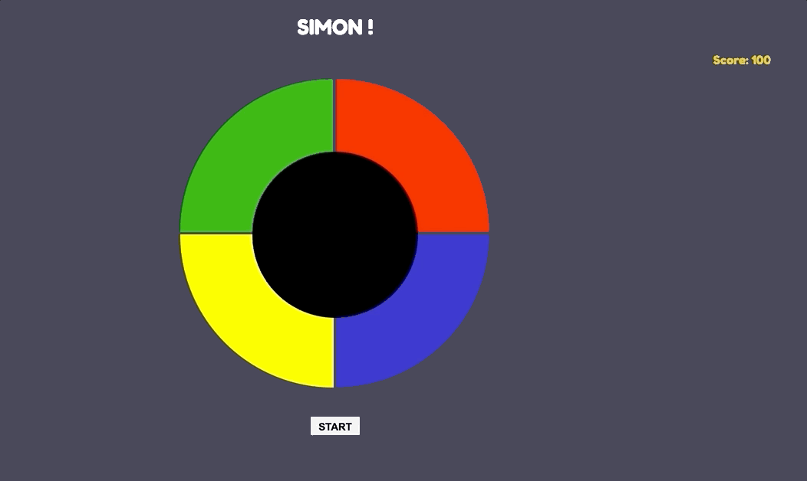

# Simon Game

Created a Simon Game using HTML/CSS/Javascript with score board feature 

Deployed Game: https://ram-bor.github.io/simon-game/

# Description

Feeling nostalgic? Play a game of Simon! 

Press Start to begin game. Simon will keep score for every correct guess. If you get one wrong, then **GAME OVER**

Note: Game is not responsive on smaller and mobile devices. Works best on a google chrome browser

# Installation 

* Clone repo: https://github.com/ram-bor/simon-game
* cd into directory 
* open index.html in browser (preferably Chrome) and enjoy!

# Contact 

https://github.com/ram-bor

